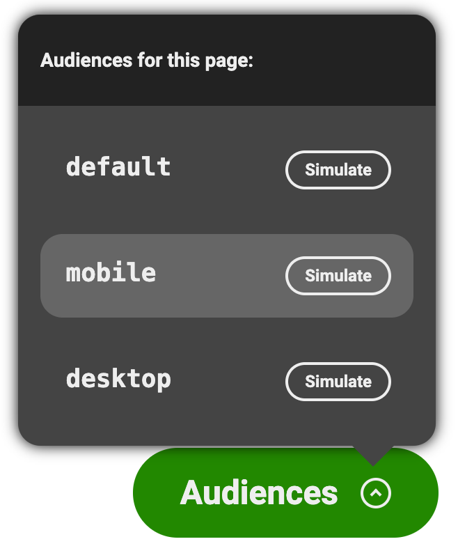

# Using audiences to personalize the experience

## Overview

With audiences you can serve different versions of your content to different groups of users based on the information you can glean from there current session. For instance, you can optimize the experience for:
- mobile vs. desktop
- Chrome vs. Firefox
- 1st vs. returning visitor
- fast vs slow connections
- different geographies
- etc.

## Set up

First, you need to define audiences for the project. This is done directly in the project codebase. Audiences are defined as a `Map` of audience names and boolean evaluating (async) functions that check whether the given audience is resolved in the current browsing session.

You'd typically define the mapping in your AEM's `scripts.js` as follows:
```js
const geoPromise = (async () => {
  const resp = await fetch(/* some geo service*/);
  return resp.json();
})();

const AUDIENCES = {
  mobile: () => window.innerWidth < 600,
  desktop: () => window.innerWidth >= 600,
  us: async () => (await geoPromise).region === 'us',
  eu: async () => (await geoPromise).region === 'eu',
}
```

As you can see in the example above, functions need to return a boolean value. If the value is truthy, the audience is considered resolved, and if it's falsy then it isn't. You can also use any browser API directly, or rely on external services to resolve an audience.

:warning: Using external services will have a performance impact on the initial page load as the call will be blocking the page rendering until the async function is fully evaluated.

The audiences for the project then need to be passed to the plugin initialization as follows:

```js
const { loadEager } = await import('../plugins/experimentation/src/index.js');
await loadEager(document, { audiences: AUDIENCES });
```

### Custom options

By default, the audience feature looks at the `Audience` metadata tags and `audience` query parameters, but if this clashes with your existing codebase or doesn't feel intuitive to your authors, you can adjust this by passing new options to the plugin.

For instance, here is an alternate configuration that would use `segment` instead of `audience`:
```js
const { loadEager } = await import('../plugins/experimentation/src/index.js');
await loadEager(document, {
  audiences: AUDIENCES,
  audiencesMetaTagPrefix: 'segment',
  audiencesQueryParameter: 'segment',
});
```

## Authoring

Once the above steps are done, your authors are ready to start using audiences for their experiences.

### Page-level audiences

Each Page can have several page-level audiences defined in the page metadata.
The audiences are set up directly in the page metadata block as follows:

| Metadata          |                                                               |
|-------------------|---------------------------------------------------------------|
| Audience: Mobile  | [https://{ref}--{repo}--{org}.hlx.page/my-page-for-mobile]()  |
| Audience: Desktop | [https://{ref}--{repo}--{org}.hlx.page/my-page-for-desktop]() |

The notation is pretty flexible and authors can also use `Audience (Mobile)` or `Audience Mobile` if this is a preferred notation.

### Section-level audiences

Each section in a page can also run any number of audiences. Section-level audiences are run after the page-level audiences have run, i.e. after the variants have been processed and their markup was pulled into the main page, so the section-level audiences that will run are dictated by the document from the current page-level experiment/audience/campaign, and not necessarily just the main page.

Section-level audiences are authored essentially the same way that page-level audiences are, but leverage the `Section Metadata` block instead:

| Section Metadata  |                                                               |
|-------------------|---------------------------------------------------------------|
| Audience: Mobile  | [https://{ref}--{repo}--{org}.hlx.page/my-page-for-mobile]()  |
| Audience: Desktop | [https://{ref}--{repo}--{org}.hlx.page/my-page-for-desktop]() |

### Fragment-level audiences

Fragment-level audiences are handled differently than page and section-level audiences. They target a specific CSS selector instead of the whole page or the section. Whenever the desired CSS `selector` is resolved in the DOM tree (i.e. whenever the element is added to the page), the audiences will be run. For AEM, this typically happens even before the `decorate` method from the block's JS file is run.

Fragment-level audiences are also authored differently than page and section-level audiences. First, you need to specify a new metadata entry:

| Metadata            |                                                                               |
|---------------------|-------------------------------------------------------------------------------|
| Audience Manifest | [https://{ref}--{repo}--{org}.hlx.page/my-audiences.json?sheet=mobile]() |

The spreadsheet then needs to be defined as follows:

| Page      | Audience | Selector | Url                             |
|-----------|----------|----------|---------------------------------|
| /my-page/ | Mobile   | .hero    | /fragments/my-page-hero-mobile  |
| /my-page/ | Desktop  | .hero    | /fragments/my-page-hero-desktop |

The same spreadsheet can also contain the configuration for several pages at once. The engine will filter out the entries in the spreadsheet that match the current page.


### Simulation

Once all of this is set up, authors will have access to an overlay on `localhost` and on the stage environments (i.e. `*.hlx.page`) that lets them see what audiences have been configured for the page and switch between each to visualize the content variations accordingly.



The simulation capabilities leverage the `audience` query parameter that is appended to the URL and forcibly let you see the specific content variant.

## Development

To help developers in designing variants for each audience, when audiences are resolved on the page it will automatically add a new CSS class named `audience-<name of the audience>` for each to the `<body>` element, i.e. `audience-mobile audience-iphone`.
