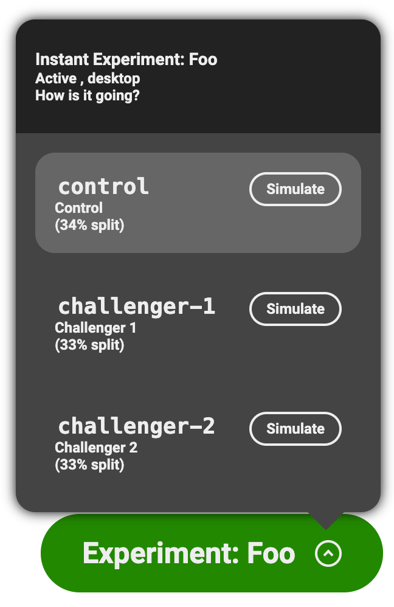

# Running A/B tests to compare variants of an experience

## Overview

With experiments (also called A/B tests) you can randomly serve different versions of your content to your end users to test out alternate experiences or validate conversion hypotheses. For instance, you can:
- compare how the wording in a hero block impacts the conversion on the call-to-action element
- compare how 2 different implementations of a specific block impact the overall performance, engagement and/or user conversion 

## Set up

The setup is pretty minimal. Once you've instrumented the experimentation plugin in your AEM website, you are essentially good to go.

Just keep in mind that if you want to only target specific audiences for that experiment, you'll also need to set up the [audiences](Audiences) accordingly for your project.

### Custom options

By default, the experiments feature looks at the `Experiment` metadata tags and the `experiment` query parameter, but if this clashes with your existing codebase or doesn't feel intuitive to your authors, you can adjust this by passing new options to the plugin.

For instance, here is an alternate configuration that would use `abtest` instead of `experiment`:
```js
const { loadEager } = await import('../plugins/experimentation/src/index.js');
await loadEager(document, {
  experimentsMetaTagPrefix: 'abtest',
  experimentsQueryParameter: 'abtest',
});
```

### Tracking custom conversion events

By default, the engine will consider any `click` a conversion. If you want to be more granular in your tests, the plugin integrates with the https://github.com/adobe/aem-rum-conversion plugin as well and will automatically detect its `Conversion Name` property (for both page level and section level metadata).

## Authoring

Once the above steps are done, your authors are ready to start using experiments for their experiences.

### Page-level experiments

Each Page can have 1 page-level experiment that is controlled via the page metadata.
The experiment is set up directly in the page metadata block as follows:

| Metadata            |                                                              |
|---------------------|--------------------------------------------------------------|
| Experiment          | Hero Test                                                    |
| Experiment Variants | [https://{ref}--{repo}--{org}.hlx.page/my-page-variant-1](), [https://{ref}--{repo}--{org}.hlx.page/my-page-variant-2](), [https://{ref}--{repo}--{org}.hlx.page/my-page-variant-3]() |

The page that is instrumented is called the `control`, and the content variations are `variants` or `challengers`.
Variants are evenly split by default, so the above would give us:
- 25% for the control (the page that has the metadata)
- 25% for each of the 3 variants that are defined

If you want to control the split ratio, you can use:

| Metadata            |                                                              |
|---------------------|--------------------------------------------------------------|
| Experiment          | Hero Test                                                    |
| Experiment Variants | [https://{ref}--{repo}--{org}.hlx.page/my-page-variant-1](), [https://{ref}--{repo}--{org}.hlx.page/my-page-variant-2](), [https://{ref}--{repo}--{org}.hlx.page/my-page-variant-3]() |
| Experiment Split    |  10, 20, 30                                                  |

This would give us the following split:

- 10% on variant 1
- 20% on variant 2
- 30% on variant 3
- 40% on the control  (i.e 100% - 10% - 20% - 30% = 40%)

A `30, 30, 40` split, would respectively give us:

- 30% on variant 1
- 30% on variant 2
- 40% on variant 3
- 0% on the control  (i.e 100% - 30% - 30% - 40% = 0%)

which would essentially disable the control page.

If you need to be really granular, decimal numbers are also supported, like `33.34, 33.33, 33.33`.

#### Code-level experiments

Note that the above assumes you have different content variants to serve, but if you want to run a pure code-based A/B Test, this is also achievable via:

| Metadata            |           |
|---------------------|-----------|
| Experiment          | Hero Test |
| Experiment Variants | 2         |

This will create just 2 variants, without touching the content, and you'll be able to target those based on the `experiment-hero-test` and `variant-control`/`variant-challenger-1`/`variant-challenger-2` CSS classes that will be set on the `<body>` element

#### Audience-based experiments

If you wanted to additionally restrict the experiments to specific audiences, so that for instance your experiment is only run on iPad or on iPhone, you'd leverage the [audiences](Audiences) feature and use the following metadata:

| Metadata            |                                                              |
|---------------------|--------------------------------------------------------------|
| Experiment          | Hero Test                                                    |
| Experiment Variants | [https://{ref}--{repo}--{org}.hlx.page/my-page-variant-1](), [https://{ref}--{repo}--{org}.hlx.page/my-page-variant-2](), [https://{ref}--{repo}--{org}.hlx.page/my-page-variant-3]() |
| Experiment Audience | iPad, iPhone                                                 |

If any of the listed audiences is resolved, then the experiment will run and the matching content will be served. The list is essentially treated as an "or".
If you needed both audiences to be resolved (i.e. treated as "and"), for say a "US" audience and the "iPad" audience, you'd define a new custom "us-ipad" audience in your project that checks for both conditions and use that in the metadata instead.

#### Time bound experiments

You can also specify start and end dates, as well as toggle the experiment status.

| Metadata              |                                                              |
|-----------------------|--------------------------------------------------------------|
| Experiment            | Hero Test                                                    |
| Experiment Variants   | [https://{ref}--{repo}--{org}.hlx.page/my-page-variant-1](), [https://{ref}--{repo}--{org}.hlx.page/my-page-variant-2](), [https://{ref}--{repo}--{org}.hlx.page/my-page-variant-3]() |
| Experiment Status     | Active                                                       |
| Experiment Start Date | 2024-01-01                                                   |
| Experiment End Date   | 2024-03-31                                                   |

The status defaults to `Active`, and supports `Active`/`True`/`On` as well as `Inactive`/`False`/`Off`.
Start and end dates are in the flexible JS [Date Time String Format](https://tc39.es/ecma262/multipage/numbers-and-dates.html#sec-date-time-string-format). If the start and/or end dates are specified, the experiment will not run if the user's time lies outside the given window.

So you can both use generic dates, like `2024-01-31` or `2024/01/31`, and time-specific dates like `2024-01-31T13:37` or `2024/01/31 1:37 pm`. You can even enforce a specific timezone so your experiment activates when, say, it's 2am GMT+1 by using `2024/1/31 2:00 pm GMT+1` or similar notations.

### Section-level experiments

Each section in a page can also run 1 experiment, so you can have as many section-level experiments as you have sections.
Section-level experiments are run after the page-level experiment has run, i.e. after the variant has been processed and its markup pulled into the main page, so the section-level experiments that will run are dictated by the document from the current page-level experiment/audience/campaign, and not necessarily just the control page.

Section-level experiments are authored essentially the same way that page-level experiments are, but leverage the `Section Metadata` block instead:

| Section Metadata    |                                                              |
|---------------------|--------------------------------------------------------------|
| Experiment          | Hero Test                                                    |
| Experiment Variants | [https://{ref}--{repo}--{org}.hlx.page/my-page-variant-1](), [https://{ref}--{repo}--{org}.hlx.page/my-page-variant-2](), [https://{ref}--{repo}--{org}.hlx.page/my-page-variant-3]() |

### Fragment-level experiments

Fragment-level experiments are handled differently than page and section-level experiments. You can essentially have as many you want and they can target any CSS selector. Whenever the desired CSS `selector` is resolved in the DOM tree (i.e. whenever the element is added to the page), the experiment will be run. For AEM, this typically happens even before the `decorate` method from the block's JS file is run.

Fragment-level experiments are also authored differently than page and section-level experiments. First, you need to specify a new metadata entry:

| Metadata            |                                                                               |
|---------------------|-------------------------------------------------------------------------------|
| Experiment Manifest | [https://{ref}--{repo}--{org}.hlx.page/my-experiments.json?sheet=hero-test]() |

The spreadsheet then needs to be defined as follows:

| Page      | Experiment | Variant      | Selector | Url                               |
|-----------|------------|--------------|----------|-----------------------------------|
| /my-page/ | Hero Test  | Challenger 1 | .hero    | /fragments/my-page-hero-variant-1 |
| /my-page/ | Hero Test  | Challenger 2 | .hero    | /fragments/my-page-hero-variant-2 |
| /my-page/ | Hero Test  | Challenger 3 | .hero    | /fragments/my-page-hero-variant-3 |

Like with regular experiments, you can also define the `Split`, `Start Date`, `End Date`, etc.

The same spreadsheet can also contain the configuration for several pages at once. The engine will filter out the entries in the spreadsheet that match the current page

### Simulation

Once all of this is set up, authors will have access to an overlay on `localhost` and on the stage environments (i.e. `*.hlx.stage`) that lets them see what experiment and variants have been configured for the page and switch between each to visualize the content variations accordingly.



The simulation capabilities leverage the `audience` query parameter that is appended to the URL and forcibly let you see the specific content variant.

### Inline Reporting

AEM Experiments performance is automatically tracked via RUM data, and can be reported directly in the overlay pill UI. Since the RUM data is not public, you'll need to obtain a **domain key** for your website and configure the pill accordingly for the data to show up.

1. Generate a domain key for your site using https://aemcs-workspace.adobe.com/rum/generate-domain-key (make sure to use exactly the same domain name that you used in your project config for go-live)
2. Click the ⚙️ icon in the pill header, and paste the provided domain key in the popup dialog
  - alternatively, you can also just run `window.localStorage.setItem('aem-domainkey', <your domain key>)` in the JS console

## Development

To help developers in designing variants for each experiment, when an experiment is running on the page it will automatically add new CSS classes named `experiment-<name of the experiment>` and `variant-<name of the resolved variant>` to the `<body>` element, i.e. `experiment-hero variant-fullpage`.
