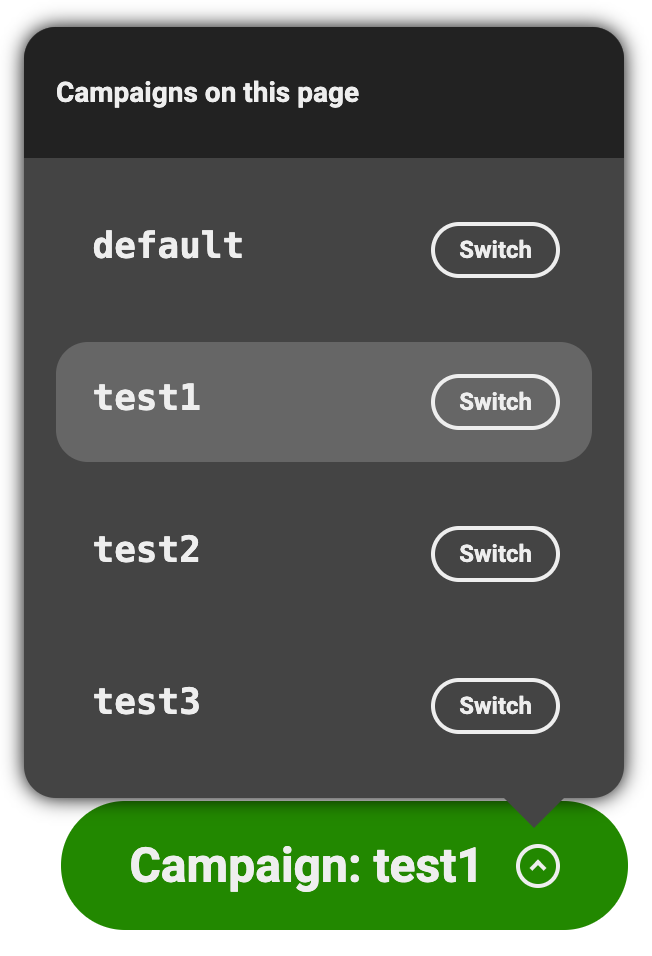

# Running marketing campaigns that personalize the experience

## Overview

With campaigns you can send out emails or social media posts that link back to your site and that will serve specific offers or versions of your content to the targeted audience.

## Set up

The setup is pretty minimal. Once you've instrumented the experimentation plugin in your AEM website, you are essentially good to go.

Just keep in mind that if you want to only target specific audiences for that campaign, you'll also need to set up the [audiences](Audiences) accordingly for your project.

### Custom options

By default, the campaigns feature looks at the `Campaign` metadata tags and `campaign` query parameter, but if this clashes with your existing codebase or doesn't feel intuitive to your authors, you can adjust this by passing new options to the plugin.

For instance, here is an alternate configuration that would use `sale` instead of `campaign`:
```js
const { loadEager } = await import('../plugins/experimentation/src/index.js');
await loadEager(document, {
  campaignsMetaTagPrefix: 'sale',
  campaignsQueryParameter: 'sale',
});
```

:mega: The campaign feature also supports the industry-standard Urchin Tracking Module (UTM) `utm_campaign` as query parameter. There is nothing special you need to do to get this working and it will be seamlessly handled the same way as the `campaignsQueryParameter`. This means that both:

- [https://{ref}--{repo}--{org}.hlx.page/my-page?campaign=xmas]()
- [https://{ref}--{repo}--{org}.hlx.page/my-page?utm_campaign=xmas]()

would essentially serve you the `xmas` variant of the experience.

## Authoring

Once the above steps are done, your authors are ready to start using campaigns for their experiences.

### Page-level campaigns

Each Page can have several page-level campaigns defined in the page metadata.
The campaigns are set up directly in the page metadata block as follows:

| Metadata            |                                                                 |
|---------------------|-----------------------------------------------------------------|
| Campaign: Xmas      | [https://{ref}--{repo}--{org}.hlx.page/my-page-for-xmas]()      |
| Campaign: Halloween | [https://{ref}--{repo}--{org}.hlx.page/my-page-for-halloween]() |

The notation is pretty flexible and authors can also use `Campaign (Xmas)` or `Campaign Halloween` if this is a preferred notation.

If you wanted to additionally restrict the campaign to specific audiences, so that for instance your campaigns are only accessible on mobile phone or on iPhone, you'd leverage the [audiences](Audiences) feature and use the following metadata:

| Metadata            |                                                                 |
|---------------------|-----------------------------------------------------------------|
| Campaign: Xmas      | [https://{ref}--{repo}--{org}.hlx.page/my-page-for-xmas]()      |
| Campaign: Halloween | [https://{ref}--{repo}--{org}.hlx.page/my-page-for-halloween]() |
| Campaign Audience   | mobile, iphone                                                  |

If any of the listed audiences is resolved, then the campaign will run and the matching content will be served.
If you needed both audiences to be resolved, you'd define a new `mobile-iphone` audience in your project and use that in the metadata instead.

### Section-level audiences

Each section in a page can also run any number of campaigns. Section-level campaigns are run after the page-level campaigns have run, i.e. after the variants have been processed and their markup was pulled into the main page, so the section-level campaigns that will run are dictated by the document from the current page-level experiment/audience/campaign, and not necessarily just the main page.

Section-level campaigns are authored essentially the same way that page-level campaigns are, but leverage the `Section Metadata` block instead:

| Section Metadata    |                                                                 |
|---------------------|-----------------------------------------------------------------|
| Campaign: Xmas      | [https://{ref}--{repo}--{org}.hlx.page/my-page-for-xmas]()      |
| Campaign: Halloween | [https://{ref}--{repo}--{org}.hlx.page/my-page-for-halloween]() |

### Fragment-level campaigns

Fragment-level campaigns are handled differently than page and section-level campaigns. They target a specific CSS selector instead of the whole page or the section. Whenever the desired CSS `selector` is resolved in the DOM tree (i.e. whenever the element is added to the page), the campaigns will be run. For AEM, this typically happens even before the `decorate` method from the block's JS file is run.

Fragment-level campaigns are also authored differently than page and section-level campaigns. First, you need to specify a new metadata entry:

| Metadata          |                                                                        |
|-------------------|------------------------------------------------------------------------|
| Campaign Manifest | [https://{ref}--{repo}--{org}.hlx.page/my-campaigns.json?sheet=2024]() |

The spreadsheet then needs to be defined as follows:

| Page      | Campaign     | Selector | Url                             |
|-----------|--------------|----------|---------------------------------|
| /my-page/ | XMas         | .hero    | /fragments/my-page-hero-xmas    |
| /my-page/ | ThanksGiving | .hero    | /fragments/my-page-hero-thxgivn |

The same spreadsheet can also contain the configuration for several pages at once. The engine will filter out the entries in the spreadsheet that match the current page.

### Simulation

Once all of this is set up, authors will have access to an overlay on `localhost` and on the stage environments (i.e. `*.hlx.stage`) that lets them see what campaigns have been configured for the page and switch between each to visualize the content variations accordingly.



## Development

To help developers in designing variants for each campaign, when a campaign is resolved on the page it will automatically add a new CSS class named `campaign-<name of the campaign>` to the `<body>` element, i.e. `campaign-xmas`.
